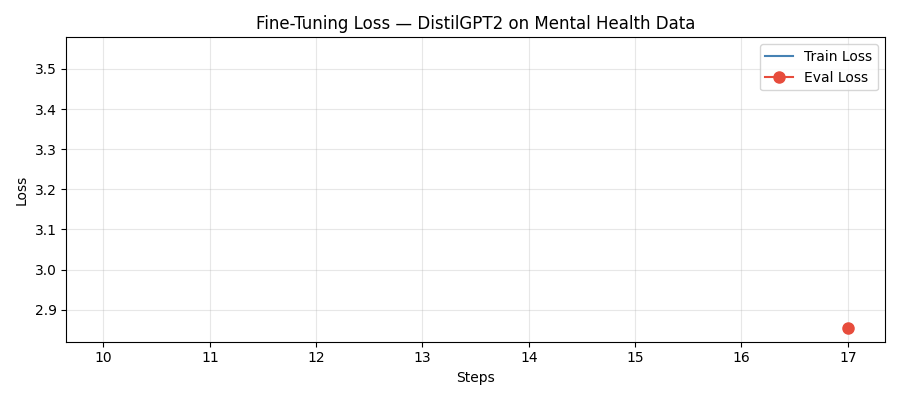
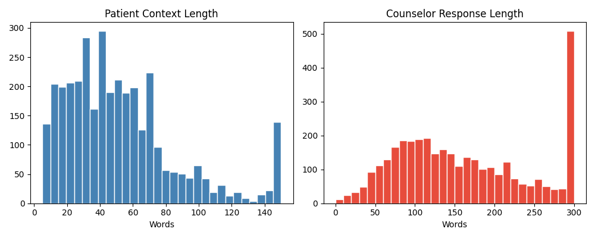

# Task 5: Mental Health Support Chatbot

## Overview
This project is a fine-tuned conversational chatbot designed to provide supportive and empathetic responses around stress, anxiety, and emotional wellness.

## Features
- Fine-tunes `DistilGPT2` on counseling-style conversation pairs
- Uses the `Amod/mental_health_counseling_conversations` dataset
- Includes training artifacts and visualizations for model review
- Demonstrates chatbot generation with a simple Script workflow

## Technologies Used
- Python
- Hugging Face Transformers
- Hugging Face Datasets
- PyTorch

## Project Structure
- `task5_mental_health_chatbot.py` - main Script for training and demo
- `task5_model/` - saved model artifacts
- `task5_loss_curve.png` - training loss visualization
- `task5_data_distribution.png` - dataset distribution visualization

## Screenshots
Training and analysis visuals are included below:

## How to Run
1. Open `task5_mental_health_chatbot.py` in VS Code.
2. Install the required Python packages if they are not already available.
3. Run the Script to reproduce training and chatbot generation.
